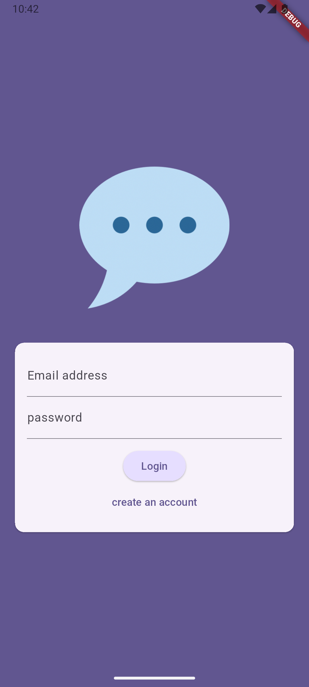

# Chat App 💬

A real-time chat application built using **Flutter** and **Firebase**, designed to enable seamless communication between users with clean UI and robust architecture.

---

## 🚀 Features
- 🔐 Firebase Authentication (Email & Password)
- 💬 Real-time messaging using **Cloud Firestore**
- 📲 Fully responsive UI (works on both Android and iOS)
- 🧠 State management via **Provider**
- 📁 Clean architecture and well-structured codebase
- ⚡ Smooth navigation and optimized performance

---

## 📸 Screenshots

### 🔐 Login Screen


---

## 🛠️ Technologies Used
- Flutter & Dart
- Firebase Authentication
- Cloud Firestore
- Provider (State Management)
- Git & GitHub

---

## 📁 Project Structure

```
<pre>
lib/
├── models/
├── screens/
├── services/
├── widgets/
├── utils/
└── main.dart
</pre>
```

⸻

🔧 Setup Instructions
1.	Clone the repository:
    git clone https://github.com/faressalah886/Chat-app.git

2.	Navigate to the project directory:
    cd Chat-app

3.	Get the dependencies:
    flutter pub get

4.	Run the app:
    flutter run

📌 Notes
	•	Make sure Firebase is properly configured in your project (add google-services.json or GoogleService-Info.plist as needed).
	•	You can add your own Firebase project credentials to test the app.

⸻

🤝 Contact

Developed by Fares Salah
Feel free to reach out via [LinkedIn](https://eg.linkedin.com/in/fares-salah-86a751354)